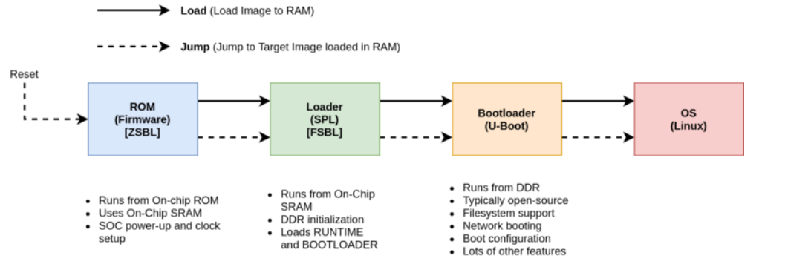
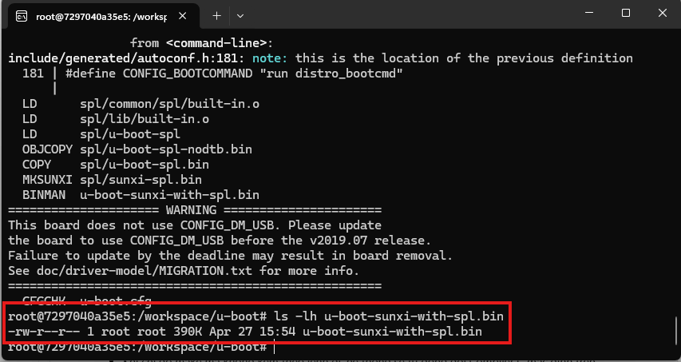

# Boot Flow on F1C100s (LicheePi Nano)



---

## 1. Boot Flow là gì?

Boot flow là quá trình từ khi cấp nguồn cho SoC đến khi hệ điều hành Linux được khởi động và sẵn sàng sử dụng.

---

## 2. Boot Pipeline (thực tế)

BootROM → SPL → U-Boot → Kernel → RootFS

#### Giải thích:
```
BootROM → SPL (SRAM) → DRAM init → U-Boot (DRAM) → Load Kernel + Device Tree (DTB) → Kernel init → Mount RootFS → User space (shell)
```
---

## 3. Chi tiết từng giai đoạn

### 3.1 BootROM (BROM)

- Là chương trình được ghi sẵn trong SoC bởi nhà sản xuất  
- Chạy ngay khi cấp nguồn  
- Không thể thay đổi  

**Nhiệm vụ:**
- Tìm boot device (SPI Flash, SD Card, NAND...)
- Đọc dữ liệu tại offset cố định
- Load SPL vào SRAM và thực thi

---

### 3.2 SPL (Secondary Program Loader)

SPL là phiên bản tối giản của U-Boot.

**Tại sao cần SPL?**

- SRAM trong chip rất nhỏ (vài chục KB)
- U-Boot đầy đủ quá lớn để nạp trực tiếp  
→ cần một chương trình nhỏ để chuẩn bị môi trường

**Nhiệm vụ:**
- Khởi tạo DRAM (RAM ngoài)
- Load U-Boot đầy đủ vào DRAM
- Chuyển quyền điều khiển cho U-Boot

---

### 3.3 U-Boot (Bootloader chính)

Sau khi DRAM sẵn sàng, U-Boot sẽ chạy trong DRAM.

**Nhiệm vụ:**
- Cung cấp command line (debug)
- Load Linux Kernel và Device Tree (DTB)
- Truyền bootargs cho kernel
- Jump vào kernel

---

### 3.4 Linux Kernel

Kernel là lõi của hệ điều hành.

**Nhiệm vụ:**
- Quản lý CPU, RAM, thiết bị ngoại vi
- Parse Device Tree (DTB) để hiểu phần cứng
- Mount Root File System

---

### 3.5 RootFS (Root File System)

RootFS là không gian user space.

**Bao gồm:**
- `/bin/sh` (shell)
- `/etc/init.d` (init scripts)
- BusyBox (các công cụ cơ bản)

Sau khi mount thành công → hệ thống sẵn sàng sử dụng.

---

## 4. Memory & Storage

### 4.1 SPI Flash

SPI Flash là bộ nhớ non-volatile dùng để lưu firmware.

**Chứa các thành phần:**
[SPL] → [U-Boot] → [Kernel] → [RootFS]


---

### 4.2 SRAM vs DRAM

| Thành phần | Đặc điểm | Vai trò |
|-----------|--------|--------|
| SRAM | Nhanh, nhỏ, trong chip | chạy SPL |
| DRAM | Lớn, ngoài chip | chạy U-Boot + Kernel |

---

## 5. SPI Flash & SPI Protocol

### 5.1 Flash Memory

- Non-volatile (không mất dữ liệu khi mất điện)
- Ghi/xóa theo block
- Dùng để lưu firmware

---

### 5.2 SPI (Serial Peripheral Interface)

SPI là giao thức giao tiếp giữa CPU và Flash.

**Các chân chính:**
- MOSI (Master → Slave)
- MISO (Slave → Master)
- SCLK (Clock)
- CS (Chip Select)

**Cách hoạt động:**
CPU → gửi lệnh → SPI Flash
SPI Flash → trả dữ liệu → CPU


---

### 5.3 So sánh Flash

| Loại | Đặc điểm | Ứng dụng |
|------|--------|----------|
| SPI NOR | Random access, nhỏ | Bootloader |
| SPI NAND | Dung lượng lớn | Storage |
| NAND | Rẻ, block access | OS |

---

## 6. Build & U-Boot Packaging

### 6.1 Clone source

```bash
docker run -it --rm lichee_build_env

git clone https://github.com/TiNredmc/u-boot.git
cd u-boot
```

### 6.2 Configure build
```bash
make ARCH=arm CROSS_COMPILE=arm-linux-gnueabi- licheepi_nano_spinand_defconfig
```
#### Giải thích

- ```ARCH=arm```: target CPU
- ```CROSS_COMPILE```: dùng toolchain ARM
- ```defconfig```: cấu hình sẵn cho board

### 6.3 Build & Packaging
```bash
u-boot-sunxi-with-spl.bin
```
### 6.4 Tại sao cần đóng gói (header)?

Không thể flash trực tiếp file U-Boot.

Vì:

- BootROM yêu cầu định dạng đặc biệt
- Cần metadata để nhận diện và load

### 6.5 Tạo image tương thích BROM
```bash
sh f1c100_uboot_spinand.sh uboot_nand.bin u-boot-sunxi-with-spl.bin
```


### 6.6 Header chứa gì?
- Magic number (để BootROM nhận diện)
- Load address (địa chỉ nạp vào RAM)
- Entry point (địa chỉ bắt đầu chạy)

### 7. Debugging
#### Case 1: Board không boot

**Symptom:**

- Không có output UART

**Cause:**

SPL không được BootROM tìm thấy (sai offset hoặc header lỗi)

**Fix:**

Build lại U-Boot
Flash đúng offset

### 8. Key Takeaways

- Hiểu rõ boot flow: BootROM → SPL → U-Boot → Kernel → RootFS
- Nắm được vai trò từng thành phần
- Hiểu sự khác biệt giữa SRAM và DRAM
- Biết cách build và đóng gói U-Boot
- Có khả năng debug lỗi boot cơ bản

### ----Ghi chú thêm:
SPI Flash: là một loại bộ nhớ lưu trữ không mất dữ liệu, dùng giao tiếp SPI (Serial Peripheral Interface) để giao tiếp với vi điều khiển hoặc CPU.
Flash là gì?
- Là bộ nhớ non-volatile (không mất dữ liệu khi mất điện)
- Ghi/xóa theo block (không ghi từng byte như RAM)

SPI là gì?

SPI là giao tiếp nối tiếp tốc độ cao, gồm 4 dây chính:

MOSI (Master → Slave)
MISO (Slave → Master)
SCLK (Clock)
CS (Chip Select)

👉 CPU đóng vai trò Master, SPI Flash là Slave
SPI Flash hoạt động như nào

Quy trình cơ bản:
CPU -> SPI Flash -> CPU


CPU gửi lệnh qua SPI
SPI Flash nhận lệnh (ví dụ: đọc, ghi, xóa)
Trả dữ liệu lại qua MISO

#### Ví dụ lệnh phổ biến:

- 0x03: đọc dữ liệu
- 0x02: ghi dữ liệu
- 0x20: xóa sector

So với NAND/NOR Flash
Loại	Đặc điểm	Dùng khi
SPI Flash (thường là NOR)	Nhỏ, đơn giản, đọc nhanh	Boot, firmware
NAND Flash	Dung lượng lớn	OS, storage
NOR Flash	Truy cập ngẫu nhiên tốt	Code execution

SRAM (Static RAM) = bộ nhớ rất nhanh, dùng để lưu dữ liệu tạm thời khi hệ thống đang chạy

DRAM (Dynamic Random Access Memory) là RAM chính của hệ thống — nơi CPU làm việc trực tiếp khi chương trình đang chạy.

